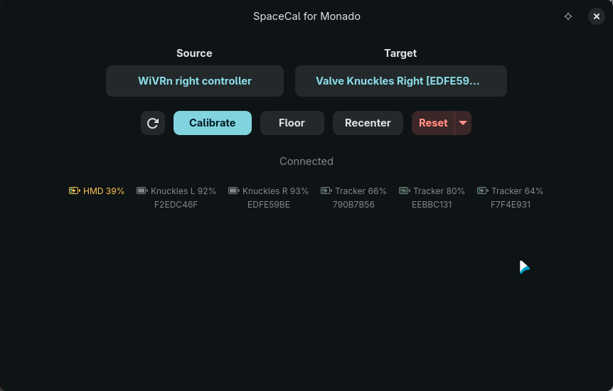

<p align="center">
  
</p>

<h1 align="center">SpaceCal for Monado</h1>

<p align="center">
  Align mixed VR tracking spaces on Linux
</p>

---

<p align="center">
  
</p>

SpaceCal aligns VR devices that use different tracking systems — like a WiVRn headset with lighthouse-tracked controllers — into a single unified space through the Monado OpenXR runtime. Pick your devices, calibrate, and play.

- **Sampled calibration** — countdown with audio cues, full-window progress bar, and confidence scoring that reports both grip consistency and axis diversity
- **Floor and recenter** — set floor height by placing a device on the ground, recenter forward direction from your HMD
- **Live device identification** — not sure which tracker is which? Move it and watch it light up in the device list
- **Battery status** — monitor charge levels for all your tracked devices at a glance

## Installation

### Arch Linux

```bash
git clone https://github.com/99oblivius/spacecal-for-monado.git
cd spacecal-for-monado
makepkg -si -p PKGBUILD-git
```

### Fedora

```bash
sudo dnf install cargo rust gtk4-devel libadwaita-devel openxr-devel monado-devel

git clone https://github.com/99oblivius/spacecal-for-monado.git
cd spacecal-for-monado
cargo build --release --locked
sudo make PREFIX=/usr install
```

## License

MIT
