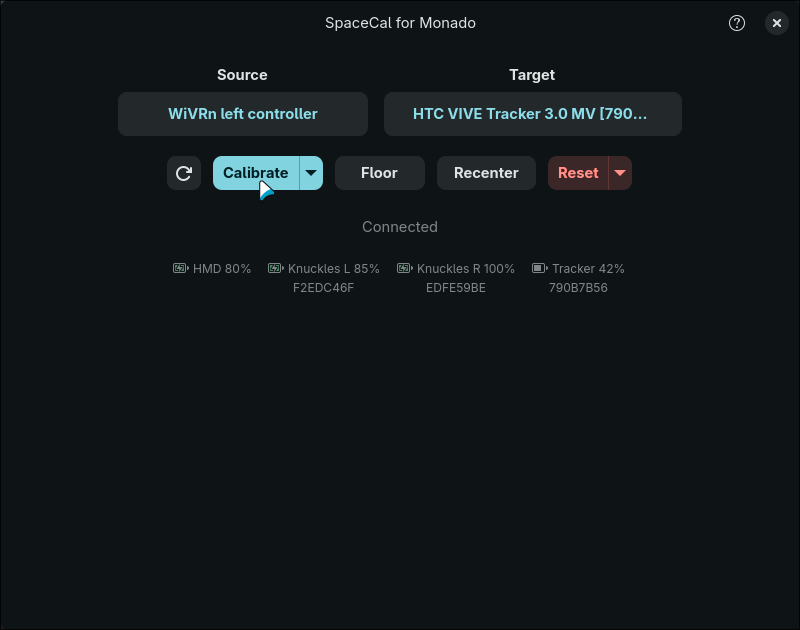
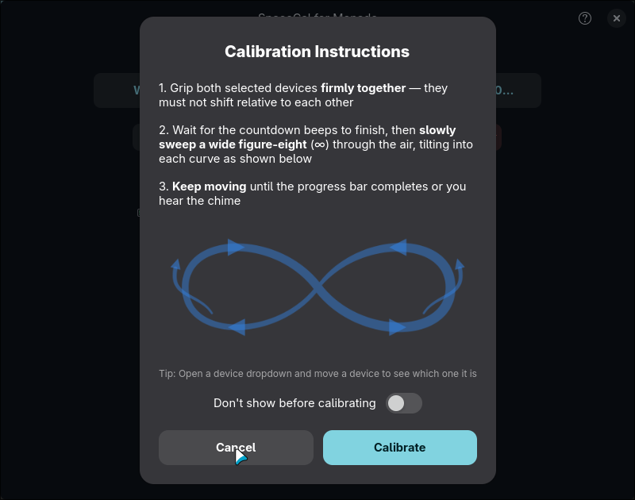

<p align="center">
  
</p>

<h1 align="center">SpaceCal for Monado</h1>

<p align="center">
  Align mixed VR tracking spaces on Linux
</p>

---

<p align="center">
  
  
</p>

SpaceCal aligns VR devices from different tracking systems into a single unified space through the Monado OpenXR runtime. Use your Quest headset with lighthouse-tracked controllers, Vive trackers, or any mix of tracking technologies.

## Features

- **Calibrate** — grip both devices together, sweep a figure-eight, done. Audio cues and a progress bar guide you through.
- **Floor** — place a device on the ground and press Floor.
- **Recenter** — face forward and press Recenter. Floor height is preserved.
- **Device identification** — open a dropdown and move a device to see which one it is.
- **Battery status** — see charge levels for all your tracked devices.
- **Reset** — reset individual tracking origins, floor, or center independently.
- **Confidence scoring** — see how good your calibration was with grip consistency and axis coverage metrics.

## Installation

### Arch Linux (AUR)

```bash
yay -S spacecal-for-monado
```

### Debian / Ubuntu

Download the `.deb` from the [latest release](https://github.com/99oblivius/spacecal-for-monado/releases/latest):

```bash
sudo dpkg -i spacecal-for-monado_*.deb
sudo apt-get install -f
```

### Fedora

Download the `.rpm` from the [latest release](https://github.com/99oblivius/spacecal-for-monado/releases/latest):

```bash
sudo dnf install spacecal-for-monado-*.rpm
```

### NixOS

```bash
nix run github:99oblivius/spacecal-for-monado
```

### From source

```bash
# Dependencies (Arch)
sudo pacman -S gtk4 libadwaita openxr monado cargo

# Dependencies (Fedora)
sudo dnf install gtk4-devel libadwaita-devel openxr-devel monado-devel cargo

# Build and install
git clone https://github.com/99oblivius/spacecal-for-monado.git
cd spacecal-for-monado
cargo build --release --locked
sudo make PREFIX=/usr install
```

## Usage

1. Start your Monado-based runtime (WiVRn, Monado standalone, etc.)
2. Launch SpaceCal
3. Select your **source** (reference device) and **target** (device to align)
4. Grip both devices firmly together and click **Calibrate**
5. Sweep a wide figure-eight through the air until the chime

## Acknowledgments

- [motoc](https://github.com/galister/motoc) by galister — early feasibility studies and Monado integration approach
- [OpenVR-SpaceCalibrator](https://github.com/pushrax/OpenVR-SpaceCalibrator) by pushrax — original calibration framework concept

## License

GPL-3.0-only
